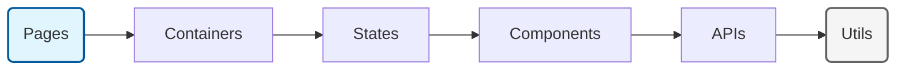

# 아키텍처

## 개요

Fractal Layered Architecture(FLA)는 프론트엔드 애플리케이션 구조를 설계하는 방법론 입니다. 이 방법론의 주요 목적은 끊임없이 변화하는 비지니스 요구사항에 대응하여 프로젝트를 안정적으로 확장시켜 나가고 유지보수 하는것 입니다.

## 목표

FLA는 단방향 레이어 구조와 각 계층의 역할을 정의하여 책임 범위를 제한합니다. 이러한 방식은 문제 발생시 영향도 범위를 제한하고 문제가 발생하는 레이어를 찾아 신속하게 대응할 수 있습니다. 또한 중첩을 허용하는 레이어 구조는 모듈을 이동하거나 확장 할 수 있는 유연한 구조를 가집니다.

## 레이어

레이어는 다음과 같은(=좌측에서 우측으로) 방향성을 갖습니다. 하위 레이어에서 상위 레이어를 참조할 수 없으며, 상위 레이어에서는 하위에 존재하는 모든 레이어에 접근이 가능합니다.



### 중첩된 레이어

레이어는 자신을 포함하여 중첩된 레이어 구조를 가질 수 있습니다. 중첩된 레이어 구조는 강한 의존성과 응집성을 갖습니다. 이러한 구조는 레이어가 다른 프로젝트로 이동되거나 삭제될때 더이상 사용되지 않는 파일이 남는것을 방지할 수 있습니다.

```bash
└── _pages # (global)
  └── profile
    └── profile.tsx # profile 페이지 구현
    └── _containers # (nested, profile)
      └── user
        └── _components # (nested, profile > user)
          ├── avatar  # user 컨테이너에 종속됨
          └── info    # user 컨테이너에 종속됨
        ├── _states
        └── _apis
└── _containers # (global)
...
```

### 레이어 역할

1. Pages: 브라우저와 상호작용하는 기능을 포함하는 레이어입니다. 브라우저 호스트 객체를 참조하거나 페이지 네비게이션 기능등이 포함될 수 있습니다.
   > 하위 레이어인 Containers, Components 구현 또는 기능을 포함할 수 있습니다. Pages 레이어에서 비지니스에 대한 모든 구현을 완료하고 점진적으로 하위 레이어로 분리하는것을 추천합니다.
2. Containers: 컨테이너는 컴포넌트를 이용하여 화면을 구성하고 데이터 상태를 핸들링 할 수 있는 레이어 입니다.
3. States: ReactQuery, Zustand등과 같은 상태를 관리하는 훅 또는 모듈을 구성하고 비지니스 로직을 담고있는 레이어 입니다.
4. Components: 내부적으로 외부 상태 값을 참조하지 않는 순수 컴포넌트 레이어 입니다. 주입된 속성이나 내부 상태정보만을 이용합니다.
5. APIs: 외부와 통신을 담당하는 레이어 입니다.
6. Utils: 그 외 정의되지 않은 항목들이 포함될 수 있습니다.

## 파일 및 디렉터리 네이밍 컨벤션

1. 파일 및 디렉터리명은 Kebab-case를 사용하여 영문 소문자 및 대시(-)를 이용하여 작성합니다.
   - 일부 시스템에서 대소문자를 구분하지 않는 이슈를 사전에 방지하고 일관성 있게 하기 위함입니다.
2. 레이어 디렉터리는 언더바(\_) 접두사를 이용하여 작성합니다.
   - 일반 모듈과 구분을 위해 접두사를 이용합니다.
3. \*.stories.ts, \*.schema.ts, \*.type.ts, \*.test.ts 등과 같이 파일내 코드를 기능별로 분리하면 모듈의 역할을 명확하게 하고 복잡도를 낮출 수 있습니다.

## 코드 작성 원칙

1. 섣부른 추상화보다 코드가 여러번 반복되는게 낫습니다. 코드가 여러번 반복되는 경우에만 하위 레이어로 내려 공통 코드로 분리하세요. 그렇지 않으면 만능 인터페이스를 가진 모듈이 탄생하거나 비슷한 기능을 갖는 관리되지 않는 공통 모듈이 늘어나게 됩니다.
2. 불필요하게 레이어를 너무 잘게 쪼게지 마세요. 모듈의 독립성 및 코드 복잡도등 관리의 필요성에 따라 점진적으로 하위 레이어로 분리하는것이 좋습니다.
3. 특정 레이어에 종속된(nested) 모듈이 상위 레이어 모듈 2개 이상에서 사용될 경우 최상위(global) 레이어 모듈로 이동하는것을 고려하세요.
